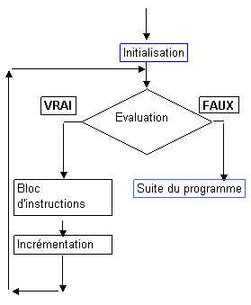

### For numbers ! 🦾

### Explanations

The for loop in PHP does not work like the while or do ... while loop, in the case of a for loop we have to declare in advance how many times we want the loop to execute.



---

Syntax :

```php
<?php

for(initialization; condition; increment/decrement) {
    /*
        Run this code until the
        condition is true
    */
}
```

The parameters used have the following meaning :

- Initialization : Here we initialize a variable with a certain value. This variable acts as the loop counter.

- Condition : We define here the condition which is checked after each iteration / cycle of the loop. If the condition returns true, then only the loop is executed.

- Incrémenter/décrémenter : Here we increment or decrement the loop counter as required.

Examples :

```php
<?php

// Display the first 10 digits.
for ($i = 1; $i <= 10; ++$i) {
    echo $i; // 12345678910
}

// Show only digits that are a modulus of 2
for ($p = 0; $p < 10; ++$p) {
    if ($p % 2) {
        echo $p . ' '; // 1 3 5 7 9
    }
}
```

### Instructions

Using a for loop display prime numbers less than 100.
Separate each prime number with a comma (except for the last).

Expected result :

```php
3, 5, 7, 11, 13, 17, 19, 23, 29, 31, 37, 41, 43, 47, 53, 59, 61, 67, 71, 73, 79, 83, 89, 97
```

**The script must be a maximum of 12 lines**

You are not allowed to use the 'range' function.

### Notions

- <a href="https://www.php.net/manual/en/control-structures.for.php" target="_blank">php.net/manual/en/control-structures.for.php</a>
- <a href="https://fr.wikipedia.org/wiki/Nombre_premier" target="_blank">Nombre premier</a>
